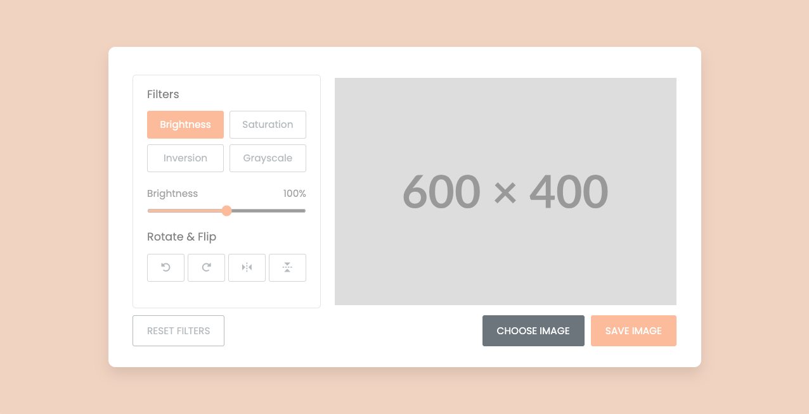

# Image Editor

A simple image editor built using HTML, CSS and JavaScript.

## Features

- Brightness adjustment
- Saturation adjustment
- Inversion
- Grayscale
- Rotation
- Flip (horizontal and vertical)
- Image saving

## How to use

1. Open the index.html file in a web browser
2. Click on the "Choose Image" button to select an image
3. Use the editor to adjust the brightness, saturation, inversion, grayscale, rotation, and flip of the image
4. Click on the "Save Image" button to download the edited image

## Browser Support

This project is tested on the following browsers:

- Google Chrome
- Mozilla Firefox
- Safari
- Microsoft Edge

  

